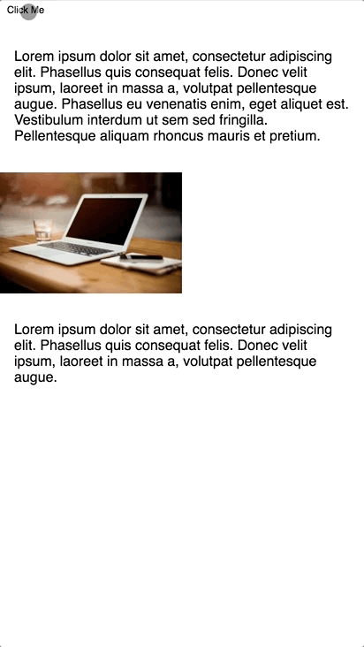

# react-layout-transition
Trying to make layout transitions simple

This project aims to provide React components that can :sparkles:_automagically_:sparkles: animate between changes in your layout.
Inspired by existing solutions on native platforms, it hopes to bring similar functionality and ease to the web.

These are some great pieces with example code on how to use the native platform feature
- [React Native’s LayoutAnimation is Awesome](https://medium.com/@Jpoliachik/react-native-s-layoutanimation-is-awesome-4a4d317afd3e) - Justin Poliachik (Medium)
- [Animate all the Things. Transitions in Android](https://medium.com/@andkulikov/animate-all-the-things-transitions-in-android-914af5477d50) - Andrey Kulikov (Medium)

**Note:** This is a very early implementation so do expect loads of bugs (but also be sure to report them)

## SharedElementTransitionGroup

Currently the only provided transition component (only handles one shared element for now).
A container around the views to transition between that animates a shared element, based on id, between it's initial and final position.

Check out the following demo at https://bkazi.github.io/react-layout-transition



```jsx
class Example extends Component {
    state = {
        switch: true,
    };

    toggle = () => {
        this.setState((prevState) => ({
            switch: !prevState.switch,
        }));
    };

    render() {
        return (
            <div>
                <button onClick={this.toggle}>Click Me</button>
                <SharedElementTransitionGroup>
                    {this.state.switch && <Page1 />}
                    {!this.state.switch && <Page2 />}
                </SharedElementTransitionGroup>
            </div>
        );
    }
}

class Page1 extends Component {
    render() {
        const imgStyle = {
            width: '50%',
            height: 'auto',
            left: '50%',
        };

        return (
            <div style={this.props.style} ref={this.props.innerRef}>
                <p>...</p>
                
                <p>...</p>
            </div>
        );
    }
}

class Page2 extends React.Component {
    render() {
        const imgStyle = {
            width: '100%',
            height: 'auto',
        };

        return (
            <div style={this.props.style} ref={this.props.innerRef}>
                
                <p>...</p>
            </div>
        );
    }
}

ReactDOM.render(
    <Example />,
    document.getElementById('root')
);
```

Please do report any bugs you encounter and point to me any examples and use cases that could be used to improve this

If you like the direction the project is headed in and want to help please do reach out!
