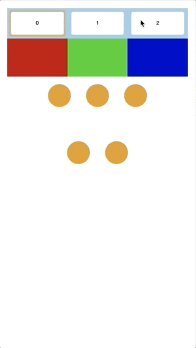
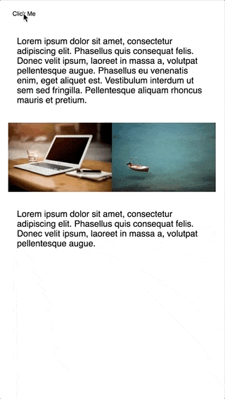

# react-layout-transition


Trying to make layout transitions simple

[](https://travis-ci.org/bkazi/react-layout-transition)
[](https://coveralls.io/github/bkazi/react-layout-transition?branch=interpolator)

Check it out at [https://react-layout-transition.surge.sh/](https://react-layout-transition.surge.sh)

This project aims to provide React components that can :sparkles:_automagically_:sparkles: animate between changes in your layout.
Inspired by existing solutions on native platforms, it hopes to bring similar functionality and ease to the web.

These are some great pieces with example code on how to use the native platform feature
- [React Native’s LayoutAnimation is Awesome](https://medium.com/@Jpoliachik/react-native-s-layoutanimation-is-awesome-4a4d317afd3e) - Justin Poliachik (Medium)
- [Animate all the Things. Transitions in Android](https://medium.com/@andkulikov/animate-all-the-things-transitions-in-android-914af5477d50) - Andrey Kulikov (Medium)

**Note:** This is a very early implementation so do expect loads of bugs and missing features (but also be sure to report them)

## Usage

react-layout-transition is available on the npm registry and can be installed via npm/yarn

```bash
npm install --save react-layout-transition
```

You can also include it directly in the browser via the [unpkg CDN](https://unpkg.com)

```html
<script src='https://unpkg.com/react-layout-transition/dist/react-layout-transition.min.js'></script>
```

## LayoutTransitionGroup

A component that animates state based changes in layout in certain parts of your view.<br>
Can handle the addition and removal of DOM nodes (as shown below)



```jsx
class Demo extends LayoutTransitionGroup {
	state = {
		config: 0,
	};

	config = (i) => {
		return () => {
			// this is where the magic happens ✨
			this.beginTransition((prevState) => ({
					config: i,
			}), [this.barRef, this.listRef], 250, 'cubic-bezier(0.64, 0.13, 0.05, 1.67)');
		};
	};

	render() {
		const config = this.state.config;
		const config1 = config === 0;
		const config2 = config === 1;
		const count = config1 ? 5 : config2 ? 6 : 7;

		const gridStyle = {
			height: '240px',
			width: '100%',
			maxWidth: '300px',
			margin: '0 auto',
			display: 'flex',
			flexDirection: 'row',
			flexWrap: 'wrap',
			justifyContent: 'center',
			flexGrow: '3',
		};

		const horizontalStyle = {
			width: '100%',
			height: '80px',
			display: 'flex',
			flexDirection: 'row',
			justifyContent: 'center',
			alignItems: 'center',
		};

		const barStyle = {
			height: '80px',
		};

		const childStyle = {
			width: '48px',
			height: '48px',
			borderRadius: '50%',
			backgroundColor: 'rgb(230, 150, 0)',
			margin: '16px',
		};

		const buttonHolder = {
			backgroundColor: 'rgb(150, 200, 230)',
			height: '64px',
			display: 'flex',
			flexDirection: 'row',
			justifyContent: 'center',
			alignItems: 'center',
		};

		const buttonStyle = {
			height: '48px',
			flexGrow: '1',
			margin: '8px',
			backgroundColor: 'white',
			border: '0',
		};
		
		return (
			<div>
				<div style={buttonHolder}>
					<button style={buttonStyle} onClick={this.config(0)}>0</button>
					<button style={buttonStyle} onClick={this.config(1)}>1</button>
					<button style={buttonStyle} onClick={this.config(2)}>2</button>
				</div>
				<div
					style={horizontalStyle}
					ref={(ref) => {
							this.barRef = ref;
					}}
				>
					<div style={{...barStyle, flexGrow: 1, backgroundColor: 'rgb(200, 0, 0)'}}></div>
					<div style={{...barStyle, flexGrow: config1 ? 1 : config2 ? 5 : 1, backgroundColor: 'rgb(0, 200, 0)'}}></div>
					<div style={{...barStyle, flexGrow: config1 ? 1 : config2 ? 5 : 10, backgroundColor: 'rgb(0, 0, 200)'}}></div>
				</div>
				<div
					style={gridStyle}
					ref={(ref) => {
							this.listRef = ref;
					}}
				>
					{[...Array(count).keys()].map((i) => <div style={childStyle} key={i}></div>)}
				</div>
			</div>
		);
	}
}
```


## SharedElementTransitionGroup

A container around the views to transition between that animates shared elements, between their initial and final position.
It classifies elements as shared if you mark them with the same id in both the intial and final layout component and does the rest for you.



```jsx
class Demo extends React.Component {
    state = {
        switch: true,
    };

    toggle = () => {
        this.setState((prevState) => ({
            switch: !prevState.switch,
        }));
    };

    render() {
        return (
            <div>
                <button onClick={this.toggle}>Click Me</button>
                <SharedElementTransitionGroup>
                    {this.state.switch && <Page1 />}
                    {!this.state.switch && <Page2 />}
                </SharedElementTransitionGroup>
            </div>
        );
    }
}

class Page1 extends React.Component {
    render() {
        const cont = {
            display: 'flex',
            flexDirection: 'row',
            justifyContent: 'center',
            alignItems: 'center',
            width: '100%',
            overflow: 'hidden',
        };

        const img1Style = {
            maxWidth: '100%',
            height: 'auto',
        };

        const img2Style = {
            maxWidth: '100%',
            height: 'auto',
        };

        return (
            <div style={this.props.style} ref={this.props.innerRef}>
                <p>...</p>
                <div style={cont}>
                    // this is where the magic happens ✨
                    
                    
                </div>
                <p>...</p>
            </div>
        );
    }
}

class Page2 extends React.Component {
    render() {
        const imgStyle = {
            width: '100%',
            height: 'auto',
        };

        return (
            <div style={this.props.style} ref={this.props.innerRef}>
                // this is where the magic happens ✨
                
                <p>...</p>
                
            </div>
        );
    }
}

```

You can find the code for the above demos in the example directory

Please do report any bugs you encounter and point to me any examples and use cases that could be used to improve this

If you like the direction the project is headed in and want to help please do reach out!
